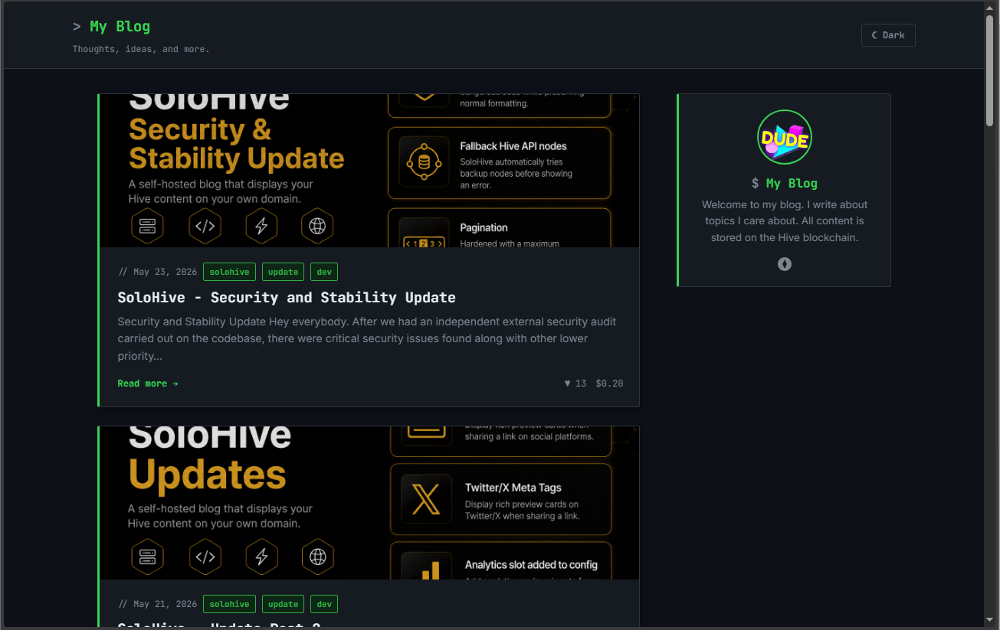
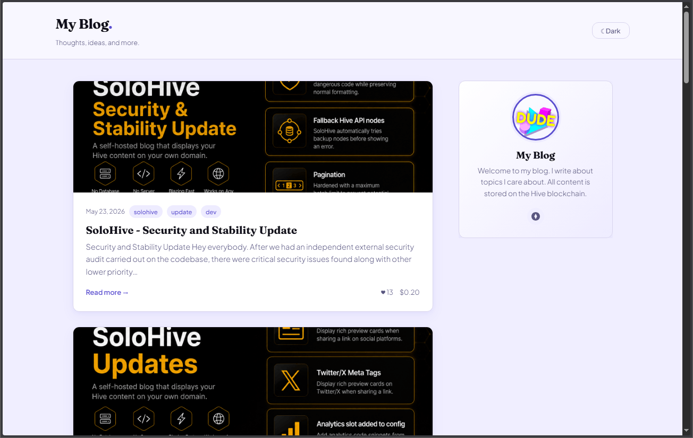

# SoloHive Themes

Drop-in CSS themes for SoloHive. Each theme is a CSS-only swap —
no changes to `app.js` or `config.js` required.

## Available Themes

| Theme | Description | Default Mode | Preview |
|-------|-------------|--------------|---------|
| [tech-dark](./tech-dark/) | Terminal-inspired dark theme for developers and tech bloggers | Dark |  |
| [photography](./photography/) | Editorial theme for photographers and travel bloggers | Light |  |
| [personal](./personal/) | Warm personality-driven theme for personal blogs and portfolios | Light |  |

## How to Install a Theme

1. Open the theme folder and download `style.css`
2. Replace the `style.css` in your SoloHive folder
3. Follow any font instructions in the theme's `README.md`
4. Upload to your host

## Creating Your Own Theme

The easiest starting point is to copy an existing theme's `style.css`
and edit the CSS variables in the `:root` block at the top.

You can also drop the default `style.css` into an AI assistant of your
choice and ask it to restyle it however you like — the file is well
commented and structured to make this easy.

## Contributing

Have a theme you'd like to share with the SoloHive community?
Open a pull request on GitHub.
