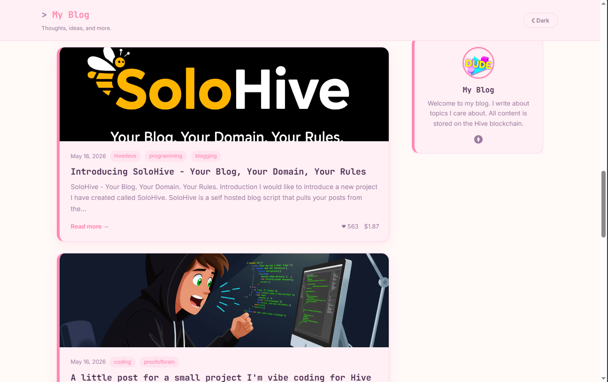
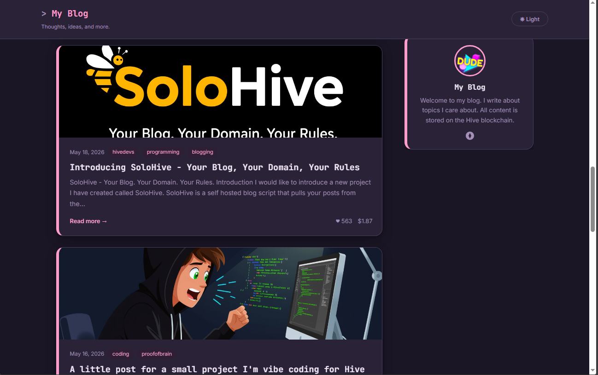

# SoloHive — Cute-alism Theme

A warm, playful theme with soft pinks, rounded pill-shaped elements,
and a friendly personality. Great for lifestyle bloggers, creators,
and anyone who wants their site to feel approachable and fun.

## Screenshots




## Preview

- Soft pink background (#fff9f8) and surface (#fff0f5)
- Pink accent (#ff8ab3) — warm and friendly
- Thick accent left border on cards and sidebar widgets
- Pill-shaped buttons and tags (border-radius: 9999px)
- Very rounded corners throughout (16px radius)
- Pink-tinted shadows with hover lift and scale effect
- Terminal prompt prefix (`> `) on site title
- Blockquotes with pink tint background fill
- Dark mode with deep purple tones (#1a1625)

## Installation

1. Replace your current `style.css` with this file
2. Update the font `<link>` tags in `index.html` and `post.html`:

```html
<link rel="preconnect" href="https://fonts.googleapis.com">
<link rel="preconnect" href="https://fonts.gstatic.com" crossorigin>
<link href="https://fonts.googleapis.com/css2?family=Inter:wght@300;400;500;600&family=JetBrains+Mono:wght@700&display=swap" rel="stylesheet">
```

That's it.

## Customization

Open `style.css` and edit the CSS variables in the `:root` block at the top.

```css
--color-accent: #ff8ab3;   /* pink — change to your brand colour */
--color-bg:     #fff9f8;   /* warm off-white background */
--radius:       16px;      /* very rounded — reduce for a less bubbly feel */
```

Some other accent colours that work well with this theme:
- `#ff6b9d` — deeper hot pink
- `#f472b6` — bright fuchsia
- `#c084fc` — soft purple
- `#fb923c` — warm coral
- `#34d399` — mint green

## Dark Mode

Full dark mode with deep purple tones that keep the playful personality
in low light. Accent shifts to a slightly lighter pink (#ff9ecc) for
better readability on the dark background.

## Notes

- Designed for CSS-only swap — no HTML changes required
- All SoloHive features supported
- Originally designed by a user with AI assistance and rebuilt
  with the complete SoloHive stylesheet structure
- `--radius: 16px` gives very bubbly rounded corners — set to `8px`
  for a gentler curve or `4px` for a more refined feel