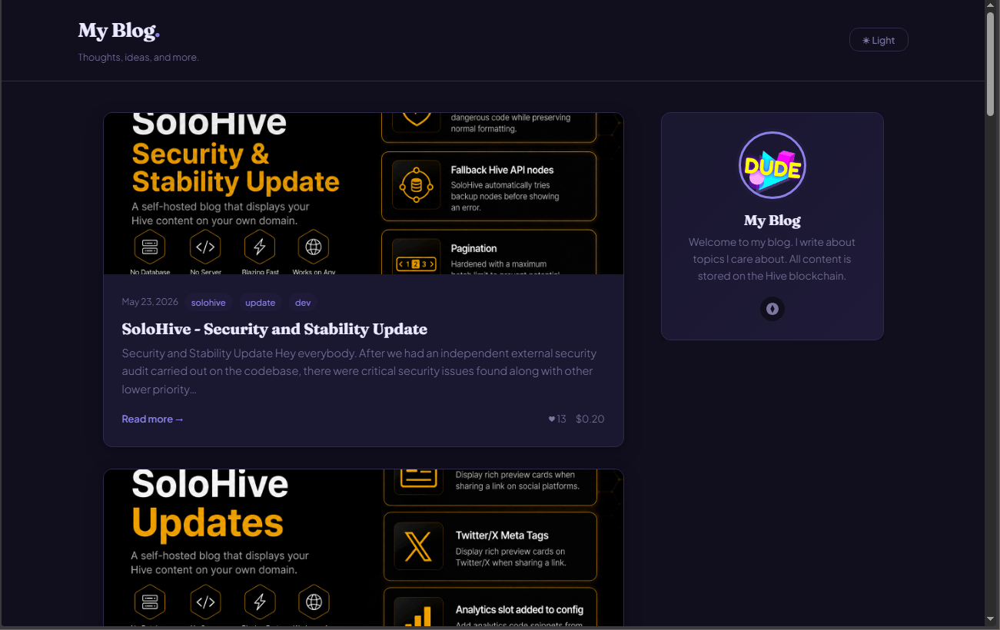

# SoloHive — Personal & Portfolio Theme

A warm, personality-driven theme for personal blogs and portfolio sites.
Clean and modern with expressive typography, soft rounded corners,
and a deep indigo accent. Designed to put the person front and center.

## Screenshots




## Preview

- Subtle lavender-tinted background (#f8f7ff)
- Deep indigo accent (#5b4fcf)
- Large rounded avatar with accent ring in sidebar
- Gradient about card for a polished profile feel
- Circular social link buttons
- Rounded corners throughout (12px radius)
- Accent dot after site title — a personal signature touch
- Expressive serif headings (Fraunces)
- Clean humanist sans body text (Plus Jakarta Sans)
- Blockquotes with accent background tint
- Post images with subtle shadow

## Installation

1. Replace your current `style.css` with this file
2. Update the font `<link>` tags in `index.html` and `post.html`:

```html
<link rel="preconnect" href="https://fonts.googleapis.com">
<link rel="preconnect" href="https://fonts.gstatic.com" crossorigin>
<link href="https://fonts.googleapis.com/css2?family=Fraunces:ital,wght@0,300;0,700;1,300;1,700&family=Plus+Jakarta+Sans:wght@300;400;500;600&display=swap" rel="stylesheet">
```

That's it.

## Customization

Open `style.css` and edit the CSS variables in the `:root` block at the top.

```css
--color-accent: #5b4fcf;   /* deep indigo — change to your brand colour */
--color-bg:     #f8f7ff;   /* subtle lavender tint */
--radius:       12px;      /* rounded corners — reduce for a sharper feel */
```

Some other accent colours that work well with this theme:
- `#0891b2` — cyan (creative/design)
- `#059669` — emerald (wellness/nature)
- `#dc2626` — red (bold/passionate)
- `#7c3aed` — violet (creative/artistic)
- `#0f766e` — teal (calm/professional)

## Dark Mode

Full dark mode with deep indigo-black tones (#110f1e) that maintain
the sophisticated feel in low light.

## Notes

- Designed for CSS-only swap — no HTML changes required
- All SoloHive features supported
- `--radius: 12px` gives soft rounded corners — set to `4px` for medium or `0` for sharp
- The gradient sidebar about card uses CSS only — no images required
